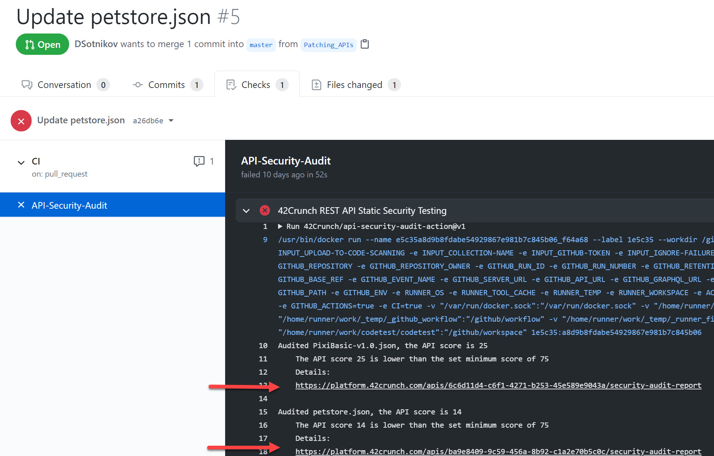
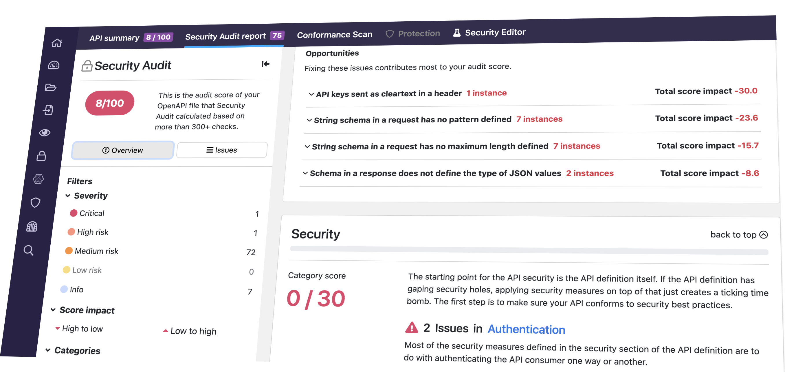
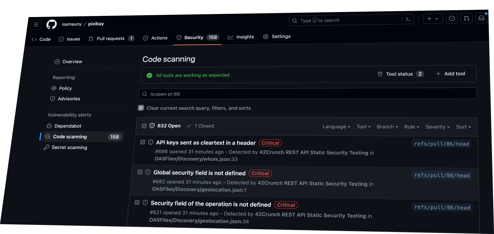
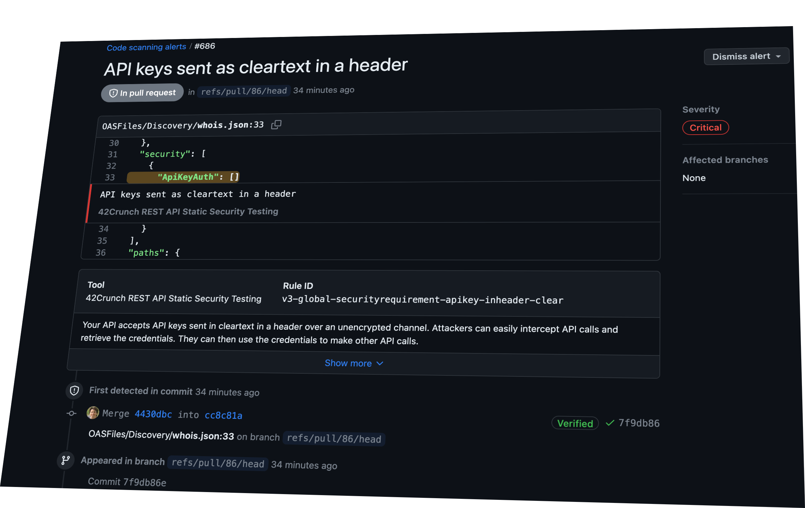

# GitHub Action: 42Crunch REST API Static Security Testing

The REST API Static Security Testing action locates REST API file contracts that follow the OpenAPI Specification (OAS, formerly known as Swagger) and runs thorough security checks on them. Both OAS v2 and v3 are supported, on both JSON and YAML format.

You can use this action in the following scenarios:

- Add an automatic static application security testing (SAST) task to your CI/CD workflows.
- Perform these checks on pull request reviews and/or code merges.
- Flag the located issues in GitHub's Security / Code Scanning Alerts.

The action is powered by 42Crunch [API Security Audit](https://docs.42crunch.com/latest/content/concepts/api_contract_security_audit.htm). Security Audit performs a static analysis of the API definition that includes more than 200 checks on best practices and potential vulnerabilities on how the API defines authentication, authorization, transport, and data coming in and going out. For more details on the checks, see [API Security Encyclopedia](https://apisecurity.io/encyclopedia/content/api-security-encyclopedia.htm).

## Discover APIs in your repositories

By default, this action will:

1. Look for any `.json` and `.yaml` files in the repository.
2. Pick the files that use OpenAPI schema.
3. Perform security audit on the OpenAPI definitions.

This way you can locate the any new or changed API contracts in the repository.

You can fine-tune how the action behaves by specifying specific parts of the repository or filename masks to be included or exclude in the discovery of APIs. You can even disable discovery completely and instead list only specific API files to be checked and map them to your existing APIs in 42Crunch API Security Platform. You configure all these settings in the configuration file `42c_conf.yaml` that you put in the root of your repository. For advanced examples, see [here](https://github.com/42Crunch/resources/tree/master/cicd/42c-conf-examples).

All discovered APIs are uploaded to an API collection in 42Crunch Platform. The action uses the environment variable `GITHUB_REPOSITORY` and `GITHUB_REF` to show the repository and the branch name from where the API collection originated from. During the subsequent action runs, the APIs in the collection are kept in sync with the changes in your repository.

## Use the action in CI/CD to block security issues

Add this action to your CI/CD workflows in GitHub and have it fail on API definitions that contain security issues.

Security Audit gives each API contract an audit score from 0 (very insecure) to 100 (no issues whatsoever). You can use he `min-score` parameter of the GitHub Action to set the threshold for the audit score where the action fails (the default is `75`, if no other value is specified). This helps to catch APIs definitions of bad quality and address the issues already during design time.

There are also other more advanced failure conditions you can set in the configuration file `42c_conf.yaml`, such as audit score by category (security or data validation), severity level of issues, or even specific issues, specified by their issue ID. For advanced examples, see [here](https://github.com/42Crunch/resources/tree/master/cicd/42c-conf-examples).

## Read detailed actionable reports

Everyy time the action runs, it includes a link to the detailed prioritized actionable report for each of your OpenAPI files:



Follow the links to read the detailed report in 42Crunch Platform:



## Get Code Scanning alerts

You can also check the issues that the action found directly in GitHub, on the **Security** tab in **Code Scanning Alerts**.

To enable that, simply include `upload-to-code-scanning:true` to the parameters of the action in your GitHub workflow.



Click any of the alerts to see its exact location in your code and to get the details of the vulnerability and the recommended remediation steps.



## Getting started

This action uses 42Crunch API Security Audit service. Before using the action, create a free 42Crunch account at https://platform.42crunch.com/register.

Then follow the steps described in [documentation](https://docs.42crunch.com/latest/content/tasks/integrate_github_actions.htm) to create an API token for the action to authenticate to 42Crunch Platform, and save it as a secret in GitHub.

## Action parameters

### `api-token`

**Required** The API token that the GitHub action uses to authenticate to 42Crunch Platform. Do not put your API token directly in the workflow file! Instead, create a Github secret in your repository settings and refer to it as shown in the example below.

### `min-score`

The minimum audit score that OpenAPI files must reach, otherwise the action fails. Default is `75`.

### `upload-to-code-scanning`

Upload the audit results to [Github Code Scanning](https://docs.github.com/en/github/finding-security-vulnerabilities-and-errors-in-your-code/about-code-scanning). Default is `false`

### `ignore-failures`

If you set this to `true`, the action does not fail even if the failures conditions (like `min-score`) you have set are met. Default is `false`.

This parameter can be useful if you do not use the GitHub action for CI/CD or pull request scenarios, but simply want it to keep updating Code Scanning alerts on each code change. 

### `platform-url`

The URL where you access 42Crunch Platform URL. Default is `https://platform.42crunch.com`, and most users do not have to change this.

If you are an enterprise customer _not_ accessing 42Crunch Platform at https://platform.42crunch.com, enter the URL you use to access the platform.

### `log-level`

Level of details in the logs, one of: `FATAL`, `ERROR`, `WARN`, `INFO`, `DEBUG`. Default is `INFO`.

### `share-everyone`

Automatically share new API collections with everyone in your organization in 42Crunch Platform. Accepted values are: `OFF`, `READ_ONLY`, `READ_WRITE`. Default is `OFF`.

## Prerequisites

Create an API token in 42Crunch Platform and copy its value into a [repository secret](https://docs.github.com/en/actions/configuring-and-managing-workflows/creating-and-storing-encrypted-secrets) named `API_TOKEN`.

## Example usage

```yaml
uses: 42Crunch/api-security-audit-action@v2
with:
  # Please create free account at https://platform.42crunch.com/register
  # Follow these steps to configure API_TOKEN https://docs.42crunch.com/latest/content/tasks/integrate_github_actions.htm
  api-token: ${{ secrets.API_TOKEN }}
```

The entire workflow which checks our the contents of the repository and runs Security Audit on the OpenAPI files found in the project might look like this:

```yaml
on: [push]

jobs:
  api_audit_job:
    runs-on: ubuntu-latest
    name: Audit OpenAPI files
    steps:
      - uses: actions/checkout@v2
      - uses: 42Crunch/api-security-audit-action@v2
        with:
          # Please create free account at https://platform.42crunch.com/register
          # Follow these steps to configure API_TOKEN https://docs.42crunch.com/latest/content/tasks/integrate_github_actions.htm
          api-token: ${{ secrets.API_TOKEN }}
          min-score: 85
```

### Fine-tuning the action

You can add a task configuration file `42c-conf.yaml` in the root of your repository, and to fine-tune the success/failure criteria. For example, you can choose on whether to accept invalid API contracts, or define a cut-off on a certain level of issue severity.

See these advanced examples [here](https://github.com/42Crunch/resources/tree/master/cicd/42c-conf-examples).

## Support

The action is maintained by support@42crunch.com. If you run into an issue, or have a question not answered here, you can create a support ticket at [support.42crunch.com](https://support.42crunch.com/).

If you are reporting an issue, do include:

- The version of the GitHub action
- Relevant logs and error messages
- Steps to reproduce the issue
