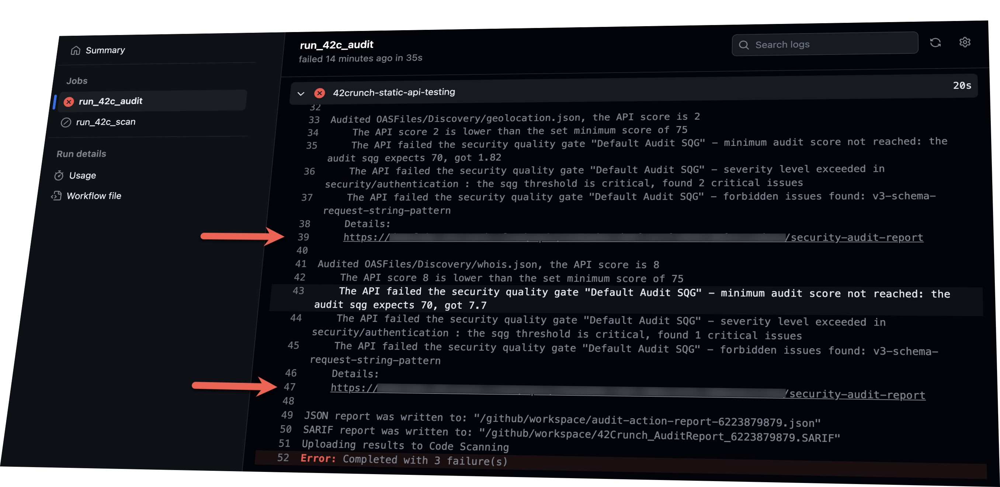

# GitHub Action: 42Crunch REST API Static Security Testing

The REST API Static Security Testing action locates REST API file contracts (Swagger or OpenAPI format, v2 and v3, JSON and YAML) and runs 200+ security checks on them.

You can use this action in the following scenarios:

- Add an automatic static application security testing (SAST) task to your CI/CD workflows
- Perform these checks on Pull Request reviews and/or code merges
- Output the located issues to GitHub's Security / Code Scanning Alerts

The action is powered by 42Crunch [API Contract Security Audit](https://docs.42crunch.com/latest/content/concepts/api_contract_security_audit.htm). Security Audit performs a static analysis of the API definition that includes more than 200 checks on best practices and potential vulnerabilities on how the API defines authentication, authorization, transport, and data coming in and going out. For more details on the checks, see [API Security Encyclopedia](https://apisecurity.io/encyclopedia/content/api-security-encyclopedia.htm).

## Discover APIs in Your Repositories

By default, this action will:

1. Look for any .json and .yaml files in the repository
2. Take the ones that use OpenAPI/Swagger schema
3. Perform their security audit

This allows you to locate the any new or changed API contracts in the repository.

You can fine-tune this behavior by specifying specific parts of the repository or filename masks to include or exclude in the search. You can even disable discovery completely and instead list specific API files to check and map them to APIs in the 42Crunch platform. This is done by using the corresponding setting in the 42c_conf.yaml file that you can put in the root of the repository. See these advanced examples [here](https://github.com/42Crunch/resources/tree/master/cicd/42c-conf-examples).

## Use in CI/CD to Block Security Issues

Add this action to your CI/CD workflows in GitHub and have it fail on insecure API definitions.

42Crunch gives each API contract a score from 0 (very insecure) to 100 (no issues whatsoever). You can set the threshold level of that score by using the `min-score` parameter of this GitHub Action.

`75` is the default threshold score used if this parameter is not specified.

You can set other more advanced failure conditions like scores by category (security or data validation), severity level of issues, or even specific issues by their ID. This is done by using the corresponding setting in the 42c_conf.yaml file that you can put in the root of the repository. See these advanced examples [here](https://github.com/42Crunch/resources/tree/master/cicd/42c-conf-examples).

## Check Pull Requests

If you want this security check to be performed automatically on each Pull Request, simply use this as a condition in your GitHub workflow file:

```yaml
on:
  pull_request:
    branches: [master]
```

Then set this Job as Required in repository **Settings / Branches / Branch protection rules / Require status checks to pass before merging**.

## Read Detailed Actionable Reports

Any time the action runs, it outputs for each OpenAPI file a link to the detailed prioritized actionable report:



Follow the links to get to the detailed report in the 42Crunch platform:


## Get Code Scanning Alerts

You can also see the issues located by this action directly in GitHub: on the **Security** tab in **Code Scanning Alerts**.

To enable that, simply include `upload-to-code-scanning:true` in this action configuration.


Click any of the alerts to see the exact location in the code and get the details of the exact vulnerability and recommended remediation steps.


## Getting Started

This action is using Security Audit service from 42Crunch. Before using the action, create a free 42Crunch account at https://platform.42crunch.com/register.

Then follow the steps described in [this documentation](https://docs.42crunch.com/latest/content/tasks/integrate_github_actions.htm) to create an API token at the 42Crunch side and save it as a secret in GitHub.

## Action Parameters

### `api-token`

**Required** The API token to access 42Crunch Platform. Please do not put your API token directly in the workflow file, but instead create a secret in your repository settings and refer to it as shown in the example below.

### `min-score`

Minimum score for OpenAPI files. Default: `75`

### `collection-name`

A name for the API collection. Default: `github`.

Note that if the Discovery mode is on, on each run, the action will delete the content of this collection in the 42Crunch platform and re-upload all the API files that it locates. In this mode, the collection at the 42Crunch side is treated as disposable.

### `upload-to-code-scanning`

Upload results to [Github Code Scanning](https://docs.github.com/en/github/finding-security-vulnerabilities-and-errors-in-your-code/about-code-scanning). Default: `false`

### `ignore-failures`

Do not fail the action even if the faiures were detected in the API contract. Default: `false`

This parameter can be useful if you are not using the action for CI/CD or pull request scenarios, but simply want it to keep updating Code Scanning alerts on each code change.

### `platform-url`

42Crunch Platform URL. Default: `https://platform.42crunch.com`

If you are an enterprise customer _not_ accessing 42Crunch Platform at https://platform.42crunch.com, enter the URL you use to access the platform.

### `log-level`

Log level, one of: FATAL, ERROR, WARN, INFO, DEBUG. Default `INFO`

## Prerequisites

Create an API token in 42Crunch platform and copy its value into a [repository secret](https://docs.github.com/en/actions/configuring-and-managing-workflows/creating-and-storing-encrypted-secrets) named `API_TOKEN`.

## Example usage

```yaml
uses: 42Crunch/api-security-audit-action@v1
with:
  # Please create free account at https://platform.42crunch.com/register
  # Follow these steps to configure API_TOKEN https://docs.42crunch.com/latest/content/tasks/integrate_github_actions.htm
  api-token: ${{ secrets.API_TOKEN }}
```

The entire workflow which checks our the contents of the repository and runs security audit on the OpenAPI files found in the project might look like this:

```yaml
on: [push]

jobs:
  api_audit_job:
    runs-on: ubuntu-latest
    name: Audit OpenAPI files
    steps:
      - uses: actions/checkout@v2
      - uses: 42Crunch/api-security-audit-action@v1
        with:
          # Please create free account at https://platform.42crunch.com/register
          # Follow these steps to configure API_TOKEN https://docs.42crunch.com/latest/content/tasks/integrate_github_actions.htm
          api-token: ${{ secrets.API_TOKEN }}
          min-score: 85
```

### Fine-tuning the action

You can add a task configuration file `42c-conf.yaml` in the root of your repository, and to fine-tune the success/failure criteria. For example, you can choose on whether to accept invalid API contracts, or define a cut-off on a certain level of issue severity.

See these advanced examples [here](https://github.com/42Crunch/resources/tree/master/cicd/42c-conf-examples).

## Support

If you run into an issue, or have a question not answered here, you can create a support ticket at [support.42crunch.com](https://support.42crunch.com/), or ask your questions on the Q&A tab here.

The pipe is maintained by support@42crunch.com.

If you’re reporting an issue, please include:

- the version of the pipe
- relevant logs and error messages
- steps to reproduce
